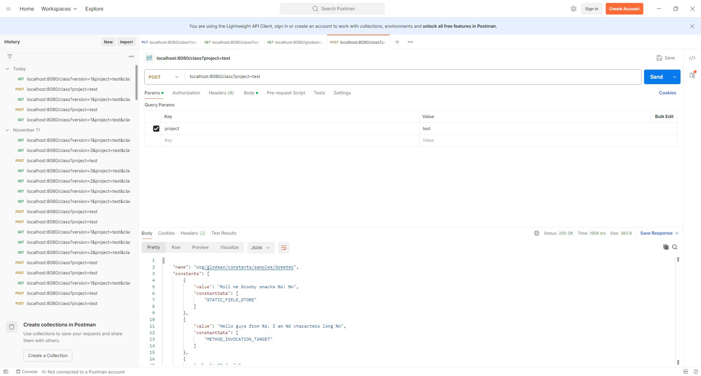
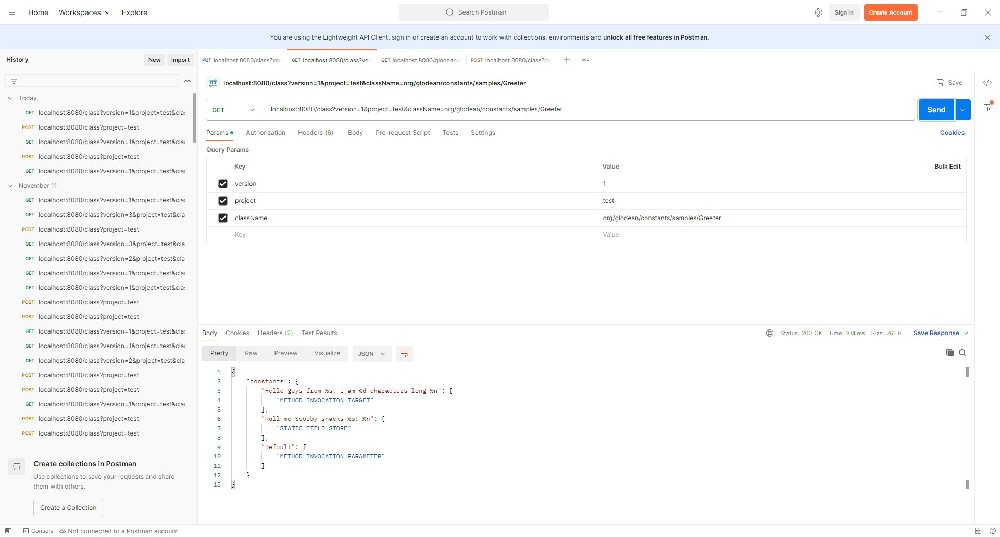
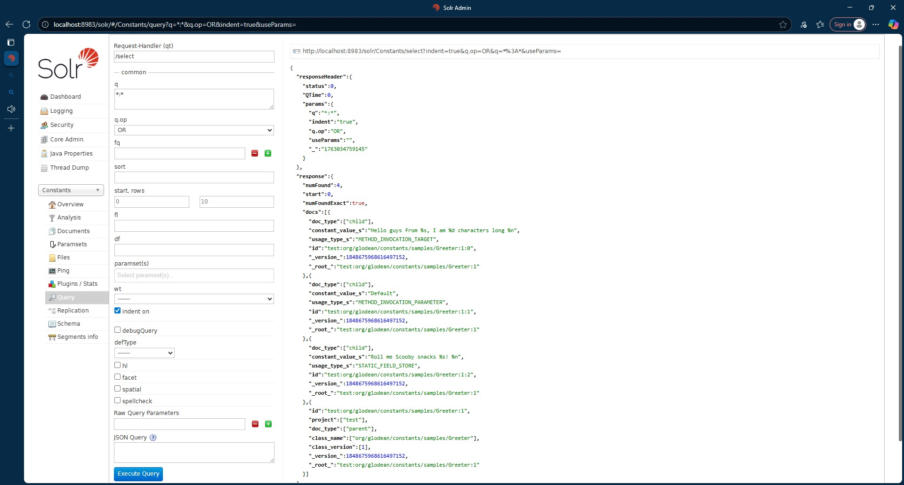

# Constant Tracker

A Spring Boot (WebFlux) service that indexes **Java bytecode constants** for fast search and analysis using Solr.

This started as an experiment in exploring the JVM class file structure — parsing the constant pool, resolving
references, and indexing them into Solr for querying and visualization.  
The focus of this project is **bytecode analysis correctness**, but in the future analysis of java files might be on the
table.

---

## 🧠 Design Focus

The central module implements a **JVM ClassFile parser** (compatible with class file format version 69 / JDK 25) and
constant-usage extractor.  
It’s tested at over **90 % coverage**, validating every supported constant type including `invokedynamic`, method
handles, and bootstrap methods.

WebFlux and Redis layers are intentionally minimal; they serve as integration and caching shells for the core analysis
engine.

---

## 🧩 Architecture

```
[ .class upload ]
       │
       ▼
[ Reactive controller ]
       │
       ▼
[ Analysis engine ]
       │
       ▼
[ Redis cache ] → [ Solr index ]
```

- **Spring Boot 3 / WebFlux** – reactive REST interface
- **Solr 9** – full-text indexing of constant references
- **Redis 7** – caching
- **Java 25** – uses latest features including ClassFile API

---

## 🚀 Quick Start

```bash
# Build the image
docker build -t constant_tracker:latest .

# Option A: Docker Compose
docker compose up -d

# Option B: Terraform (advanced)
terraform init && terraform apply -auto-approve

# Upload a class file for analysis
curl -X POST "http://localhost:8080/class?project=demo"   -H "Content-Type: application/octet-stream"   --data-binary @samples/Greeter.class
```

Once started:

- API → http://localhost:8080
- Solr UI → http://localhost:8983/solr/#/
- Swagger UI → http://localhost:8080/swagger-ui.html

---

## 🧪 Tests

- **Bytecode parser:** > 85+ % coverage (JaCoCo report under `build/reports/jacoco`)
- **Reactive API:** minimal tests verifying upload and integration
- **Integration stack:** Terraform / Docker Compose for Solr + Redis environments

---

## 📦 Mock Files and Samples

Example `.class` and `.java` files are included in the [`samples`](./src/test/resources/samples) and [
`java samples`](./src/test/java/org/glodean/constants/samples) folders.  
They can be used to test or demonstrate the analysis process without compiling your own Java sources.

```bash
# Example: analyze a provided mock class, the project parameter can be any string
curl -X POST "http://localhost:8080/class?project=samples"   -H "Content-Type: application/octet-stream"   --data-binary @samples/ExampleConstants.class
```

---

## 📸 Screenshot
In Postman you can store the Greeter.class file as follows:

You can check if it was store using Postman:

or with the Solr UI:


---

## 🧩 Technical Highlights

- Custom parser for JVM constant pool (fields, methods, strings, class refs, dynamic invocations)
- Handles `invokedynamic` and bootstrap method resolution
- Exports constants and metadata to Solr documents
- Reactive and container-ready (WebFlux + Redis + Solr)
- Built and tested on JDK 25

---

## 📚 API Documentation

- Swagger UI: /swagger-ui.html or /swagger-ui/index.html
- OpenAPI JSON v3/api-docs

## 🛠️ Build & Run Locally

```bash
./gradlew clean build
java -jar build/libs/constant-tracker-0.1.0-SNAPSHOT.jar
```

---

## 🧭 Future Work

- Enrich analysis with method flow graphs
- Add Testcontainers integration tests
- Extend Solr schema for cross-reference search
- Optional GraalVM native image

---

## 📜 License

MIT © Gabriel Glodean
