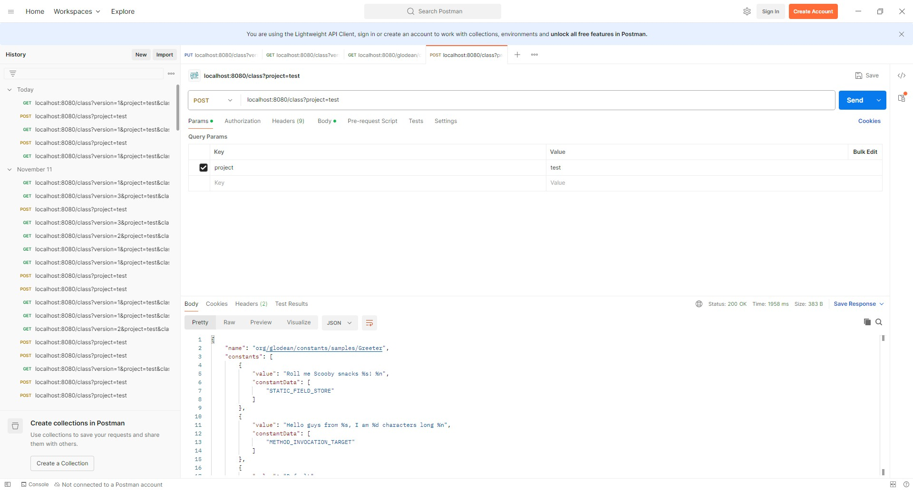
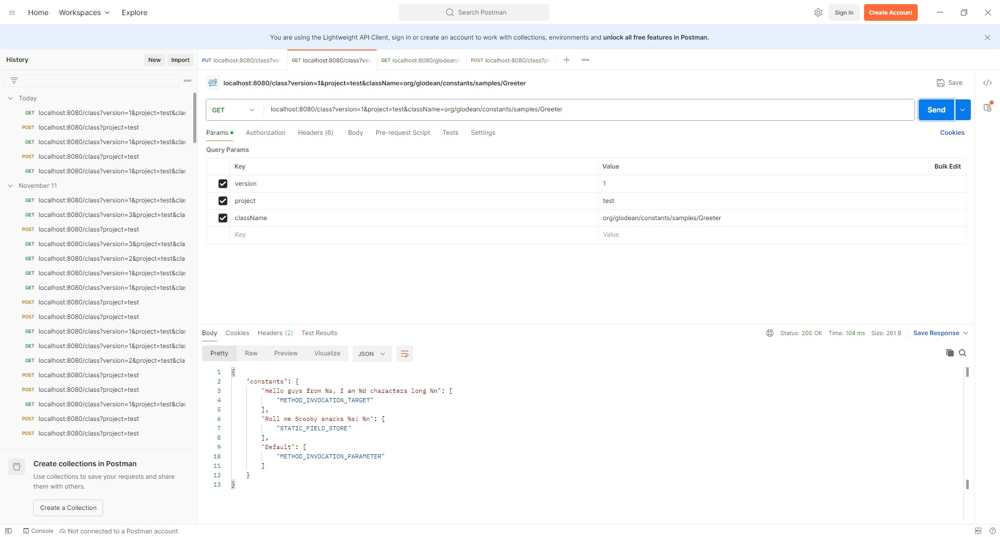
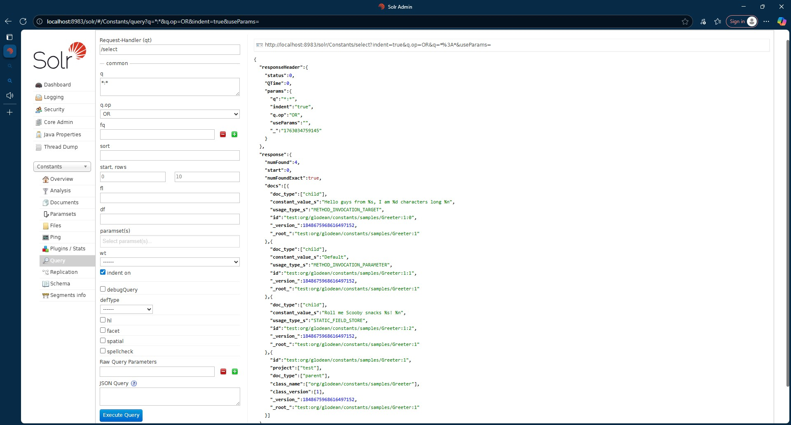

# Constant Tracker

A Spring Boot (WebFlux) service that indexes **Java bytecode constants** for fast search and analysis using Solr.

This started as an experiment in exploring the JVM class file structure — parsing the constant pool, resolving
references, and indexing them into Solr for querying and visualization.  
The focus of this project is **bytecode analysis correctness**, but in the future analysis of java files might be on the
table.

---

## 🧠 Design Focus

This project is split into **two modules** for clean separation and reusability:

The **`constant-extractor-lib`** module implements a **JVM ClassFile parser** (compatible with class file format version 69 / JDK 25) and constant-usage extractor. It's tested at over **90% coverage**, validating every supported constant type including `invokedynamic`, method handles, and bootstrap methods.

The **`constant-tracker-app`** module provides a reactive web service built with WebFlux. The Redis and Solr layers are intentionally minimal; they serve as integration and caching shells for the core analysis engine.

The library can be used **standalone** in any Java project that needs bytecode analysis capabilities.

---

## 🧩 Architecture

This is a **multi-module Gradle project** with clear separation of concerns:

### Modules

1. **`constant-extractor-lib`** – Core bytecode analysis library
   - JVM ClassFile parser (format version 69 / JDK 25)
   - Constant pool extraction and resolution
   - Model classes for bytecode structures
   - Zero external dependencies (except Guava and testing tools)
   - Can be used standalone in any Java project

2. **`constant-tracker-app`** – Spring Boot application
   - Reactive REST API (WebFlux)
   - Redis caching layer
   - Solr indexing integration
   - Docker and Terraform deployment
   - Depends on `constant-extractor-lib`

### Data Flow

```
[ .class upload ]
       │
       ▼
[ WebFlux Controller ] (constant-tracker-app)
       │
       ▼
[ Analysis Engine ] (constant-extractor-lib)
       │
       ▼
[ Redis Cache ] → [ Solr Index ] (constant-tracker-app)
```

### Technology Stack

- **Spring Boot 3 / WebFlux** – reactive REST interface
- **Solr 9** – full-text indexing of constant references
- **Redis 7** – caching
- **Java 25** – uses latest features including ClassFile API

---

## 🚀 Quick Start

```bash
# Build the image
docker build -f constant-tracker-app/Dockerfile -t constant_tracker:latest .

# Option A: Docker Compose
docker compose -f constant-tracker-app/docker-compose.yml up -d

# Option B: Terraform (advanced)
terraform init && terraform apply -auto-approve

# Upload a class file for analysis
curl -X POST "http://localhost:8080/class?project=demo" \
  -H "Content-Type: application/octet-stream" \
  --data-binary @constant-extractor-lib/src/test/resources/samples/Greeter.class
```

Once started:

- API → http://localhost:8080
- Solr UI → http://localhost:8983/solr/#/
- Swagger UI → http://localhost:8080/swagger-ui.html

---

## 🧪 Tests

### Run All Tests
```bash
./gradlew test              # Run tests in all modules
./gradlew testAll           # Alternative: run all tests and show summary
./gradlew testReport        # Generate combined test report
```

### Run Heavy Tests (JRT Filesystem Analysis)
```bash
./gradlew :constant-tracker-app:heavyTest   # Run with 16GB heap
```

### Module-Specific Tests
- **`constant-extractor-lib`:** > 90% coverage (JaCoCo report under `constant-extractor-lib/build/jacocoHtml`)
- **`constant-tracker-app`:** Integration tests verifying upload, caching, and Solr indexing

### Test Reports
- Combined report: `build/reports/allTests/index.html`
- Per-module JaCoCo: `{module}/build/jacocoHtml/index.html`

---

## 📦 Mock Files and Samples

Example `.class` and `.java` files are included in the test resources:
- `.class` files: `constant-extractor-lib/src/test/resources/samples/` and `constant-tracker-app/src/test/resources/samples/`
- `.java` files: `constant-extractor-lib/src/test/java/org/glodean/constants/samples/`

They can be used to test or demonstrate the analysis process without compiling your own Java sources.

```bash
# Example: analyze a provided mock class
curl -X POST "http://localhost:8080/class?project=samples" \
  -H "Content-Type: application/octet-stream" \
  --data-binary @constant-extractor-lib/src/test/resources/samples/Greeter.class
```

---

## 📸 Screenshot
In Postman you can store the Greeter.class file as follows:

You can check if it was store using Postman:

or with the Solr UI:


---

## 🧩 Technical Highlights

- Custom parser for JVM constant pool (fields, methods, strings, class refs, dynamic invocations)
- Handles `invokedynamic` and bootstrap method resolution
- Exports constants and metadata to Solr documents
- Reactive and container-ready (WebFlux + Redis + Solr)
- Built and tested on JDK 25 (it can analyze all the java 25 runtime in about 2 and a half minutes on an i7-13620 with 16 GB RAM allocated to the JVM)

---

## 📚 API Documentation

- Swagger UI: /swagger-ui.html or /swagger-ui/index.html
- OpenAPI JSON v3/api-docs

## 🛠️ Build & Run Locally

### Build All Modules
```bash
./gradlew clean build
```

### Run the Application
```bash
# From the root directory
./gradlew :constant-tracker-app:bootRun

# Or run the built JAR
java -jar constant-tracker-app/build/libs/constant-tracker-app-0.1.0-SNAPSHOT.jar
```

### Build Only the Library
```bash
./gradlew :constant-extractor-lib:build
```

The library JAR will be available at `constant-extractor-lib/build/libs/`

---

## 🧭 Future Work

- Enrich analysis with method flow graphs
- Extend Solr schema for cross-reference search
- Optional GraalVM native image

---

## 📜 License

MIT © Gabriel Glodean
