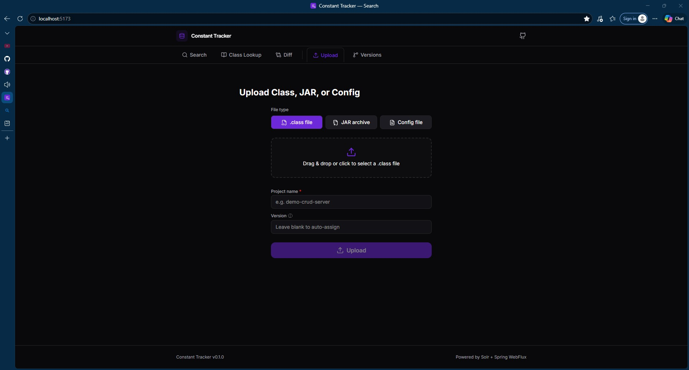
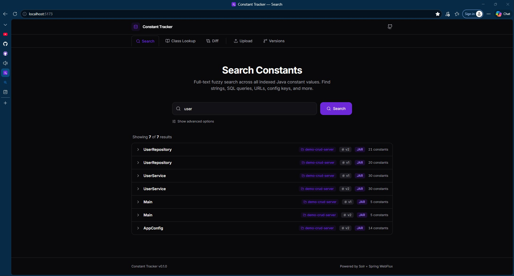
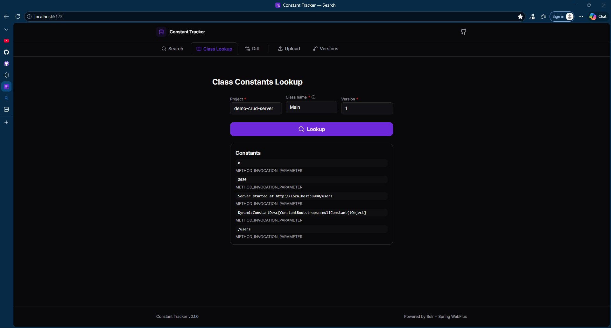
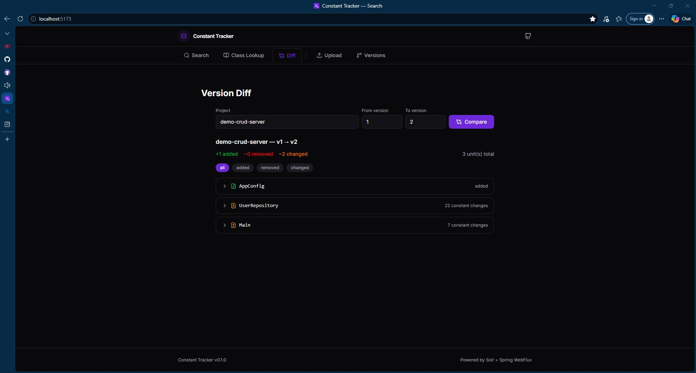
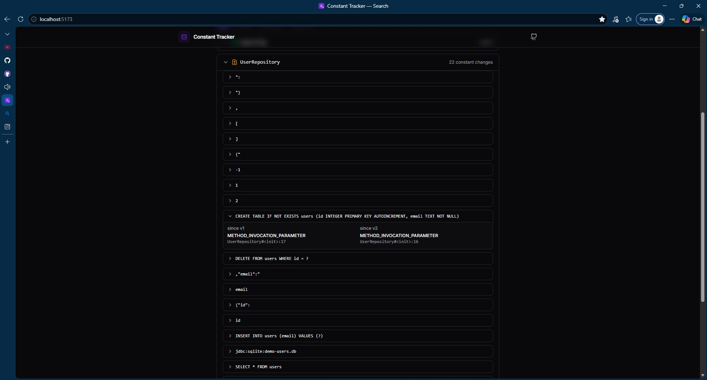
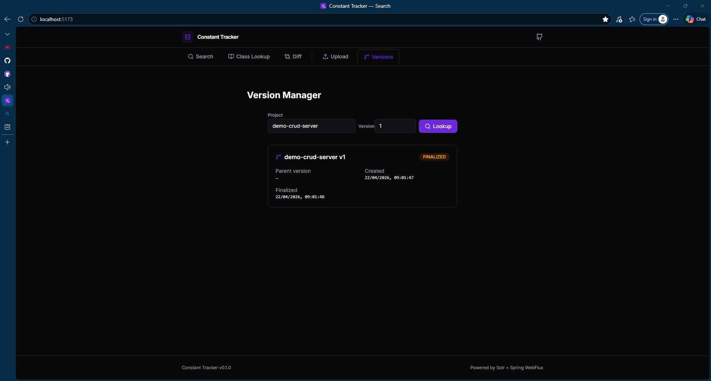

# Constant Tracker

Indexes hardcoded constants (strings, numbers) from Java bytecode and config files (YAML, properties). Supports keyword search, semantic type filtering, and version diffing.

---

## Stack

- **Backend:** Spring Boot 3 / WebFlux, Java 25
- **Search:** Solr 10
- **DB:** Postgres 17 (R2DBC + Flyway)
- **Cache:** Redis 7
- **UI:** React 19 + TypeScript, Vite, Tailwind CSS, Nginx

---

## Local Development

**Prerequisites:** Docker, Docker Compose, JDK 25, Node 22

```bash
git clone https://github.com/gabrielglodean/constant-tracker.git
cd constant-tracker
cp .env.example .env          # fill in credentials
docker compose --profile=seed up -d
```

UI: http://localhost:5173 | API: http://localhost:8080 | Solr: http://localhost:8983/solr/#/

### Compose profiles

| Profile | Command | Effect |
|---------|---------|--------|
| *(none)* | `docker compose up -d` | Start all services |
| `seed` | `docker compose --profile=seed up -d` | Start + upload demo data (demo-crud-server v1 + v2) |
| `clear` | `docker compose --profile=clear up clear` | Wipe Postgres, Solr, Redis |

**Re-seed from scratch:**
```bash
docker compose --profile=clear up clear
docker compose down            # required — tears down the stale network
docker compose --profile=seed up -d
```

### Troubleshooting

**Solr permission error on first start:**
```bash
sudo rm -rf ./.solr_data
sudo mkdir -p ./.solr_data
sudo chown -R 8983:8983 ./.solr_data
docker compose up -d solr
```

---

## Authentication

Authentication is **enabled by default** and uses short-lived JWT access tokens (1 h) plus long-lived refresh tokens (7 days) stored in PostgreSQL with a Redis-backed blacklist.

| Env var | Default | Purpose |
|---------|---------|---------|
| `CONSTANTS_AUTH_ENABLED` | `true` | Set to `false` to disable auth entirely |
| `CONSTANTS_AUTH_JWT_SECRET` | *(dev placeholder)* | **Change in production** — min 32 chars |
| `CONSTANTS_AUTH_JWT_EXPIRATION_MS` | `3600000` | Access token lifetime (ms) |
| `CONSTANTS_AUTH_REFRESH_TOKEN_TTL_MS` | `604800000` | Refresh token lifetime (ms) |
| `CONSTANTS_AUTH_CLEANUP_BLACKLIST_CRON` | `0 0 2 * * *` | Cron for purging expired blacklist rows |
| `CONSTANTS_AUTH_CLEANUP_REFRESH_TOKENS_CRON` | `0 15 2 * * *` | Cron for purging expired refresh tokens |

**Token lifecycle:**
- `POST /auth/login` → `{ accessToken, refreshToken }`
- `POST /auth/refresh` → new `{ accessToken, refreshToken }` (refresh token is rotated on every call — always store the new one)
- `POST /auth/logout` → blacklists the access token and revokes the refresh token in parallel

Protected endpoints require `Authorization: Bearer <accessToken>`.

---

## Production (k3s / Kubernetes)

Deployment is managed via Terraform + k3s. Requires a server with k3s installed and a Cloudflare Tunnel pointed to `http://localhost:80`.

```bash
cp terraform.tfvars.example terraform.tfvars   # fill in server IP, SSH key, credentials
terraform init
terraform apply
```

Terraform will:
1. Install k3s if not present
2. Copy k8s manifests and Solr config to the server
3. Apply all manifests (namespace → ConfigMaps → Redis → Postgres → Solr → app → UI → ingress)
4. Create secrets
5. Seed demo data if JAR hashes have changed

Re-deploy after code or manifest changes: `terraform apply` — triggers are based on JAR and k8s manifest hashes.

**Manual seed/clear on the server:**
```bash
kubectl delete job seed-job -n constant-tracker --ignore-not-found=true
kubectl apply -f /opt/constant-tracker/k8s/jobs.yml --selector=app=seed-job
kubectl wait --for=condition=complete job/seed-job -n constant-tracker --timeout=300s
```

---

## Using the UI

- **Search** — keyword search across all indexed constants; filter by semantic type (SQL, URL, File Path, Logging, Error Message, Annotation)
- **Upload** — upload `.class`, `.jar`, `.yml`, or `.properties` files to index a project version
- **Class lookup** — view all constants in a specific class by project/version
- **Diff** — compare two finalized versions of a project and see added/removed/changed constants per class
- **Version manager** — create, finalize, sync removals, and delete project versions

Try with the seeded demo: search `SELECT` or `http://`, then diff `demo-crud-server` version `1` → `2`.








---

## API

When auth is enabled, obtain a token first:

```bash
# Sign in
TOKEN=$(curl -s -X POST http://localhost:8080/auth/login \
  -H "Content-Type: application/json" \
  -d '{"username":"admin","password":"secret"}' | jq -r .accessToken)

# Upload a class file
curl -X POST "http://localhost:8080/class?project=myproject" \
  -H "Authorization: Bearer $TOKEN" \
  -H "Content-Type: application/octet-stream" \
  --data-binary @MyClass.class

# Upload a JAR
curl -X POST "http://localhost:8080/jar?project=myproject&jarName=myapp.jar" \
  -H "Authorization: Bearer $TOKEN" \
  -H "Content-Type: application/octet-stream" \
  --data-binary @myapp.jar
```

Full API docs: http://localhost:8080/swagger-ui.html

---

## Build & Test

```bash
./gradlew test                                       # all tests
./gradlew testReport                                 # HTML report → build/reports/allTests/
./gradlew :constant-extractor-bytecode:check         # tests + JaCoCo ≥85%
./gradlew :constant-tracker-app:heavyTest            # 16 GB heap; full-runtime analysis
./gradlew spotlessApply                              # auto-format

# UI
cd search-ui && npm test -- --watchAll=false         # 212 Jest tests
```

---

## Modules

| Module | Description |
|--------|-------------|
| `constant-extractor-api` | Shared model + SPI (no framework dependencies) |
| `constant-extractor-bytecode` | JVM bytecode parser, 6 semantic classifiers |
| `constant-extractor-config-file` | YAML + properties extraction |
| `constant-tracker-app` | Spring Boot service + REST API |
| `search-ui` | React UI |
| `demo-crud-server` (v1/v2) | Demo fixtures for seeding and diff demos |

---

## License

MIT © Gabriel Glodean
