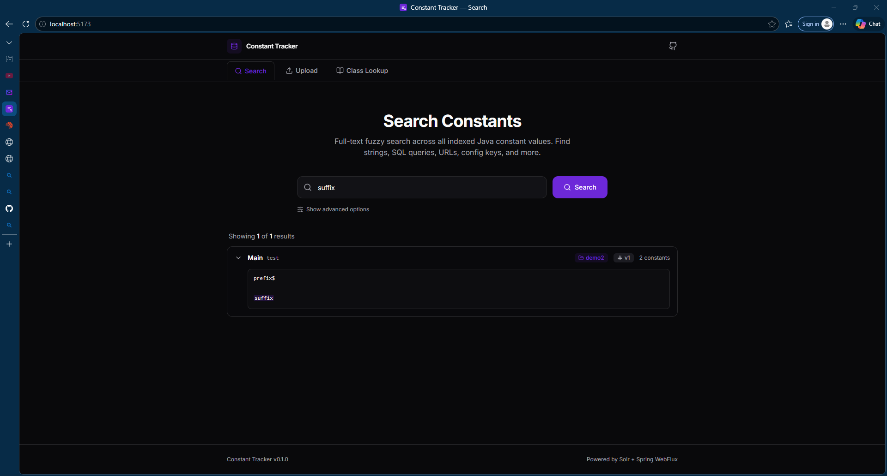

# Constant Tracker

A Spring Boot (WebFlux) service that indexes **Java bytecode constants** and **configuration file constants** for fast search and analysis using Solr.

This started as an experiment in exploring the JVM class file structure — parsing the constant pool, resolving
references, and indexing them into Solr for querying and visualization.  
The focus of this project is **bytecode analysis correctness**, but config file analysis (YAML, properties) is also supported.

---

## 🚀 Quick Start (3 commands)

```bash
git clone https://github.com/gabrielglodean/constant-tracker.git
cd constant-tracker
docker compose --profile=seed up -d
```

Open [http://localhost:5173](http://localhost:5173) — the `seed` profile automatically uploads **two versions** of `demo-crud-server` (v1 with hardcoded constants, v2 with an `AppConfig` class + `app.properties`) so you have data to explore and diff immediately.

Upload a JAR → search for `SELECT` or `http://` → see indexed constants with semantic classifications.  
Open the **Diff** tab → enter project `demo-crud-server`, from `1`, to `2` → see exactly what changed between versions.


> **Prerequisites:** Docker and Docker Compose. The first build takes a few minutes (Gradle + npm).

---

## 🧠 Design Focus

This project is split into **five modules** for clean separation and reusability:

- The **`constant-extractor-api`** module defines the shared model, SPI interfaces (`ConstantUsageInterpreter`, `ModelExtractor`), and context types. It has zero framework dependencies and is the contract between all extractor implementations.
- The **`constant-extractor-bytecode`** module implements a **JVM ClassFile parser** (compatible with class file format version 69 / JDK 25) and constant-usage extractor. It includes six semantic classifiers (Logging, SQL, URL/Resource, File Path, Error Message, Annotation). It's tested at over **90% coverage**, validating every supported constant type including `invokedynamic`, method handles, and bootstrap methods.
- The **`constant-extractor-config-file`** module extracts constants from YAML (`.yml`/`.yaml`) and Java properties (`.properties`) files, reusing the shared model from `constant-extractor-api`.
- The **`constant-tracker-app`** module provides a reactive web service built with WebFlux. The Redis, Solr, and Postgres layers serve as integration, caching, and persistence shells for the core analysis engine.
- The **`search-ui`** module is a lightweight web UI for searching, browsing, uploading, and managing indexed constants and project versions. It is served as a static site and communicates with the backend API.

The extractor libraries can be used **standalone** in any Java project that needs bytecode or config-file analysis capabilities.

Additionally, the **`demo-crud-server`** module is a framework-free Java application used for testing — it exercises as many semantic types as possible (SQL, URLs, file paths, etc.) to validate the extraction pipeline.

---

## 🧩 Architecture

This is a **multi-module Gradle project** with clear separation of concerns:

### Modules

1. **`constant-extractor-api`** – Shared model & SPI
   - Model records (`UnitConstants`, `UnitConstant`, `UnitDescriptor`, `UsageType`, `SemanticType`)
   - `ConstantUsageInterpreter` strategy interface + context types
   - `ModelExtractor` interface
   - Zero external dependencies

2. **`constant-extractor-bytecode`** – Core bytecode analysis library
   - JVM ClassFile parser (format version 69 / JDK 25)
   - Constant pool extraction and resolution
   - Six semantic classifiers: Logging, SQL, URL/Resource, File Path, Error Message, Annotation
   - `ConstantUsageInterpreterRegistry` for wiring classifiers
   - Depends on `constant-extractor-api` and Guava

3. **`constant-extractor-config-file`** – Config file analysis library
   - YAML extractor (SnakeYAML)
   - Java properties extractor
   - Depends on `constant-extractor-api`

4. **`constant-tracker-app`** – Spring Boot application
   - Reactive REST API (WebFlux)
   - Redis caching layer + versioning
   - Solr indexing integration
   - Database persistence with Postgres (R2DBC + Flyway migrations)
   - Project version lifecycle management (open → finalized)
   - Docker and Terraform deployment
   - Depends on all three extractor modules

5. **`search-ui`** – Web-based search interface
   - React 19 + TypeScript + Tailwind CSS v4
   - Fuzzy search, class lookup, file upload (class/JAR/config), version management, **version diff viewer**
   - Located in the `search-ui/` directory (served as a static site via Nginx)

6. **`demo-crud-server`** – Test fixture application (v1)
   - Framework-free Java HTTP server with CRUD endpoints
   - Exercises SQL, URL, file path, and other constant types for extraction testing

7. **`demo-crud-server-v2`** – Refactored test fixture (v2)
   - Introduces `AppConfig` class + `app.properties` to replace hardcoded constants
   - Seeded alongside v1 under the same project (`demo-crud-server`) as version 2, enabling diff demos out of the box

### Data Flow

**Class/JAR/Config Upload and Indexing:**
```
[ .class/.jar/.yml/.properties upload ]
       │
       ▼
[ WebFlux Controller ] (constant-tracker-app)
       │
       ▼
[ Analysis Engine ] (constant-extractor-bytecode / constant-extractor-config-file)
       │
       ▼
[ Redis Cache ] → [ Solr Index + Postgres DB ] (constant-tracker-app)
```

**Class and Project Query:**
```
[ class and project query ]
       │
       ▼
[ WebFlux Controller ] (constant-tracker-app)
       │
       ▼
[ Redis Cache ] → [ Postgres DB ] (constant-tracker-app)
```

**Fuzzy Search Constant Query:**
```
[ fuzzy search constant query ]
       │
       ▼
[ WebFlux Controller ] (constant-tracker-app)
       │
       ▼
[ Redis Cache ] → [ Solr Index ] (constant-tracker-app)
```

### Technology Stack

**Backend:**
- Spring Boot 3 / WebFlux – reactive REST interface
- Solr 10 – full-text indexing of constant references
- Postgres 17 – relational storage for detailed class constants usage (R2DBC + Flyway)
- Redis 7 – caching
- Java 25 – uses latest features including ClassFile API

**Frontend (search-ui):**
- React 19 + TypeScript – UI framework and language
- Vite 8 – build tool and dev server
- Tailwind CSS v4 – utility-first CSS framework
- Lucide React – icon library
- Native fetch API – for backend communication
- ESLint – code linting
- Nginx – static file serving in production Docker
- Docker – containerization for deployment

---

## 🖥️ UI

This project includes a search UI for browsing, querying, uploading, and managing indexed constants.

- **Location:** `search-ui/` directory (served as a static site)
- **Features:**
  - Fuzzy constant search across projects
  - **Version diff** — compare two versions of the same project, see added/removed/changed constants per class
  - Class constant lookup by project/class/version
  - File upload (`.class`, `.jar`, `.yml`/`.yaml`, `.properties`)
  - Version management (lookup, close/finalize, sync removals, delete units)
- **Access:**
  - When running with Docker Compose, the UI is available at: [http://localhost:5173](http://localhost:5173)
  - The UI communicates with the backend API at [http://localhost:8080](http://localhost:8080)

---

## 🗄️ Database


The application uses three main data stores:

- **Solr 9/10**: Full-text search and indexing of constant references.
  - Default URL: [http://localhost:8983/solr/](http://localhost:8983/solr/)
  - Collection: `Constants`
  - Schema: `constant-tracker-app/solr/managed-schema.xml` (auto-mounted by Docker Compose)
- **Postgres**: Relational database for persistent storage of metadata and application state.
  - Default URL: `jdbc:postgresql://localhost:5432/constant_tracker`
  - ⚠️ Before starting Postgres, ensure the database credentials are specified in the environment variables.
- **Redis 7**: Caching and versioning.
  - Default URL: `localhost:6379`

All services are started automatically with Docker Compose for local development. The Solr schema is auto-mounted into the container — no manual copy step required.


---

## 🐳 Getting Started with Docker Compose

All services are managed via Docker Compose. The stack includes the backend, Solr, Postgres, Redis, and the search UI.

### Compose Profiles

| Profile | Command | Description |
|---------|---------|-------------|
| *(none)* | `docker compose up -d` | Start all core services (backend, Solr, Postgres, Redis, UI) |
| `seed` | `docker compose --profile=seed up -d` | Start all services **and** upload the demo JAR for instant data |
| `clear` | `docker compose --profile=clear up clear` | **Wipe all data** from Postgres, Solr, and Redis (keeps services running) |

### Typical workflow

```bash
# First time: start everything and seed demo data
docker compose --profile=seed up -d

# Reset data (e.g. after a re-index or code change):
docker compose --profile=clear up clear

# Re-seed after clearing:
docker rm -f seed
docker compose --profile=seed up -d seed
```

### Rebuilding after code changes

```bash
# Rebuild a specific service image
docker compose build app
docker compose build search-ui

# Restart with the new image
docker compose up -d app
docker compose up -d search-ui
```

### Services & ports

Once running:
- **Search UI**: [http://localhost:5173](http://localhost:5173)
- **API**: [http://localhost:8080](http://localhost:8080)
- **Swagger UI**: [http://localhost:8080/swagger-ui.html](http://localhost:8080/swagger-ui.html)
- **Solr UI**: [http://localhost:8983/solr/#/](http://localhost:8983/solr/#/)
- **Postgres**: `localhost:5432`
- **Redis**: `localhost:6379`


## 🧪 Tests

### Run All Tests
```bash
./gradlew test              # Run tests in all modules
./gradlew testAll           # Alternative: run all tests and show summary
./gradlew testReport        # Generate combined test report
```

### Run Heavy Tests (JRT Filesystem Analysis)
```bash
./gradlew :constant-tracker-app:heavyTest   # Run with 16GB heap
```

### Module-Specific Tests
- **`constant-extractor-bytecode`:** > 85% coverage (JaCoCo report under `constant-extractor-bytecode/build/jacocoHtml`)
- **`constant-extractor-config-file`:** > 85% coverage (JaCoCo report under `constant-extractor-config-file/build/jacocoHtml`)
- **`constant-tracker-app`:** Integration tests verifying upload, caching, and Solr indexing

### Test Reports
- Combined report: `build/reports/allTests/index.html`
- Per-module JaCoCo: `{module}/build/jacocoHtml/index.html`

---

## 📦 Mock Files and Samples

Example `.class` and `.java` files are included in the test resources:
- `.class` files: `constant-extractor-bytecode/src/test/resources/samples/` and `constant-tracker-app/src/test/resources/samples/`
- `.java` files: `constant-extractor-bytecode/src/test/java/org/glodean/constants/samples/`

They can be used to test or demonstrate the analysis process without compiling your own Java sources.

```bash
# Example: analyze a provided mock class
curl -X POST "http://localhost:8080/class?project=samples" \
  -H "Content-Type: application/octet-stream" \
  --data-binary @constant-extractor-bytecode/src/test/resources/samples/Greeter.class
```

---

## 📸 Screenshot
In Postman you can store the Greeter.class file as follows:

You can check if it was store using Postman:

or with the Solr UI:


The UI layer looks like this:


---

## 🧩 Technical Highlights

- Custom parser for JVM constant pool (fields, methods, strings, class refs, dynamic invocations)
- Handles `invokedynamic` and bootstrap method resolution
- Six semantic classifiers: Logging, SQL, URL/Resource, File Path, Error Message, Annotation
- Config file extraction: YAML and Java properties
- Exports constants and metadata to Solr documents
- Project version lifecycle with inheritance and removal sync
- **Constant diff analysis** — compares two finalized versions of a project, returning added/removed/changed constants per unit (class, config file, etc.) with full usage context
- Reactive and container-ready (WebFlux + Redis + Solr + Postgres)
- Built and tested on JDK 25 (it can analyze all the java 25 runtime in about 2 and a half minutes on an i7-13620 with 16 GB RAM allocated to the JVM)

---

## 📚 API Documentation

- Swagger UI: /swagger-ui.html or /swagger-ui/index.html
- OpenAPI JSON v3/api-docs

## 🛠️ Build & Run Locally

### Build All Modules
```bash
./gradlew clean build
```

### Run the Application
```bash
# From the root directory
./gradlew :constant-tracker-app:bootRun

# Or run the built JAR
java -jar constant-tracker-app/build/libs/constant-tracker-app-0.1.0-SNAPSHOT.jar
```

### Build Only the Libraries
```bash
./gradlew :constant-extractor-api:build
./gradlew :constant-extractor-bytecode:build
./gradlew :constant-extractor-config-file:build
```

The library JARs will be available under each module's `build/libs/` directory.

---

## 📜 License

MIT © Gabriel Glodean
